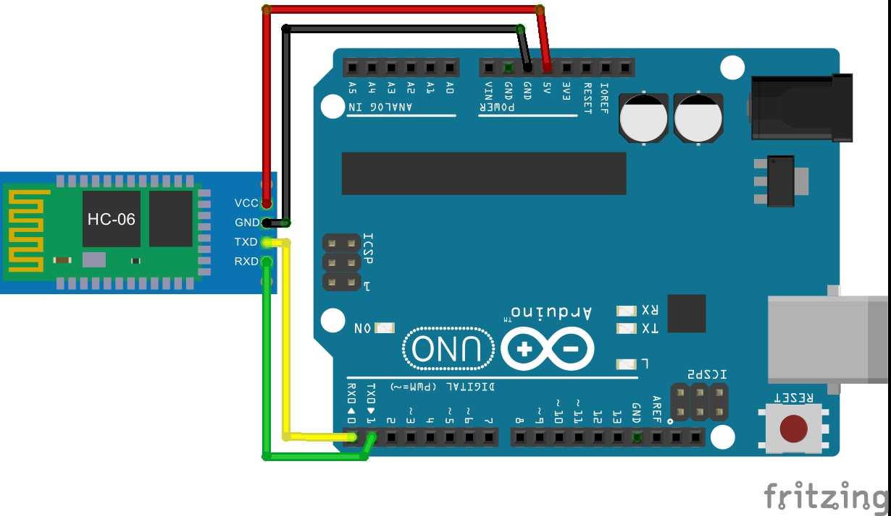
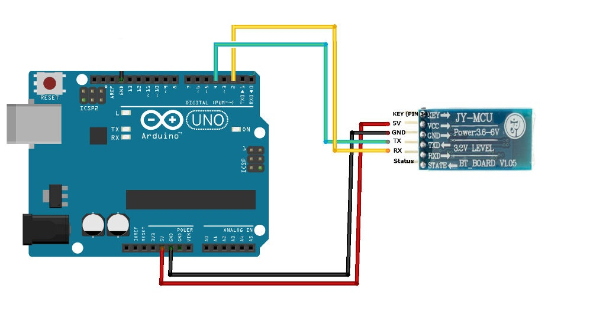
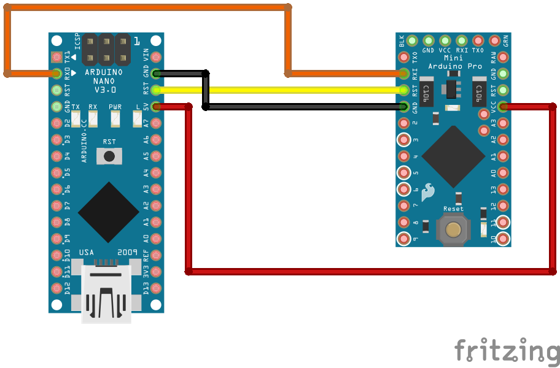
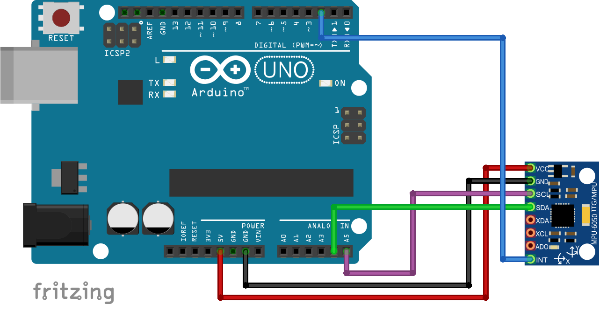

# iCare
Arduino smart bracelet attempt

I'm sharing this this Arduino project I found in an old pendrive; this is probably one of the earliest versions of 
my final project for highschool. 

The concept of iCare was a smart bracelet that kids prone to epilectic seizures would wear, so that their parents get
notified trough an app as soon as the attact starts to happen. 
I don't have an arduino right now so I can't check out the state of the code, however the contents here may be useful
examples for using the accelerometer and gyroscope with the arduino to differentiate between walking, standing
and a having seizures by comparing data of the components.

### These images were used in the presentation: 

  
   

### And here's the connection of all the components involved
(Just for reference,as we actually used the arduino nano to make it fit in a bracelet):

  
   
  
  

